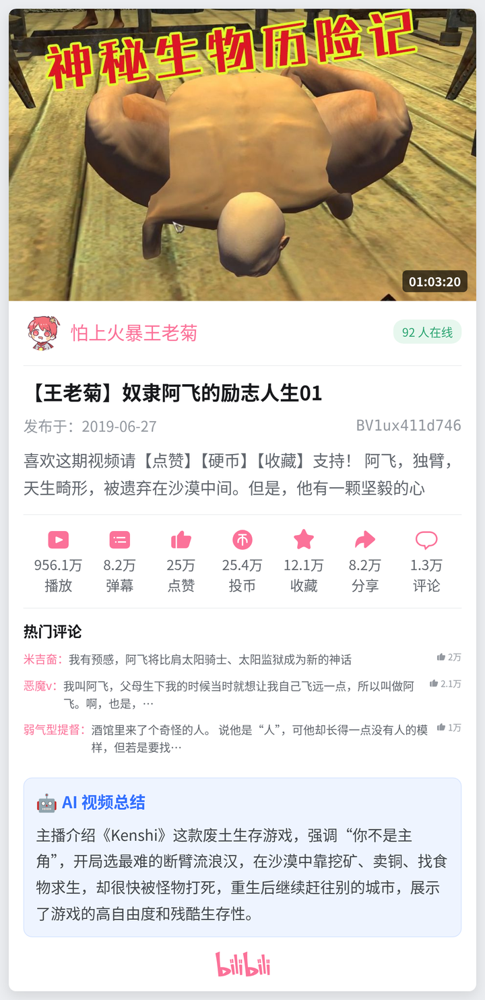
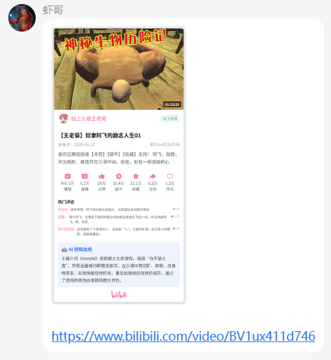

# astrbot_plugin_bilicard

B站视频解析卡片插件 for [AstrBot](https://github.com/AstrBotDevs/AstrBot)。

自动识别群聊/私聊中的 **B站视频链接、BV号、b23 短链、QQ 小程序分享卡片**，抓取视频信息后渲染成一张精美卡片图片回复——无需 @机器人、无需唤醒词、无需任何指令前缀。同时支持**订阅 UP主新投稿并自动推送**。

## ✨ 功能

- **自动解析**：群里有人发 B站视频（链接 / BV号 / av号 / b23 短链 / QQ 小程序卡片），自动回复信息卡片
- **信息丰富**：封面、时长、UP主头像、实时在线观看人数、标题、发布日期、BV号、简介、7 项统计（播放/弹幕/点赞/投币/收藏/分享/评论）、热门评论
- **AI 视频总结**：提取字幕用 LLM 生成一段总结（链接解析卡片专属）
- **订阅推送**：订阅 UP主，有新投稿时自动渲染卡片推送到对应群（订阅卡片带"投稿了新视频"气泡）
- **两种模板**：
  - 链接解析卡片：无顶部气泡 + 有 AI 总结
  - 订阅推送卡片：有顶部气泡 + 无 AI 总结
- **防刷屏**：同一视频冷却时间内不重复解析
- **访问控制**：触发范围（群/私聊）、基于 UMO 的会话黑/白名单、管理类指令仅管理员可用

## 📸 效果预览

| 卡片效果 | 分享示例 |
| :---: | :---: |
|  |  |

## 📦 安装

1. 将本插件目录放到 AstrBot 的 `data/plugins/` 下（或在插件市场安装）
2. 安装依赖：
   ```bash
   pip install -r requirements.txt
   ```
   （主要是 `qrcode[pil]`，用于扫码登录生成二维码；`aiohttp` 通常已自带）
3. 重启 / 重载 AstrBot

## 🔑 关于 B站登录

- **看视频卡片**（信息、统计、在线人数、热门评论）：**无需登录**，开箱即用
- **AI 总结**（需要字幕）和 **订阅推送**（UP主投稿接口有风控）：**需要登录 B站**

两种登录方式（任选其一）：

### 方式一：扫码登录（推荐）

发送指令 `/B站登录`，用 B 站手机 APP 扫描二维码并确认，插件会自动获取并保存 Cookie。

### 方式二：手动填写 Cookie

由于 B 站部分视频信息及字幕接口需要登录态，可手动提供账号 Cookie 中的 `SESSDATA` 和 `bili_jct` 两个字段。

**使用浏览器插件获取（适合新手）：**

1. 安装 [Cookie Editor](https://cookie-editor.com/) 浏览器插件。
2. 登录 B 站后，打开 Cookie Editor，找到 `SESSDATA` 和 `bili_jct` 的值，复制。
3. 进入 AstrBot 后台 → AstrBot 插件 → 找到 **BiliCard**，将复制的值分别填入配置项 `bilibili_cookie` 的对应输入框中。

**使用开发者工具获取（适合进阶）：**

1. 在电脑端浏览器登录 [bilibili.com](https://www.bilibili.com)，按 `F12` 打开开发者工具。
2. 切换到「网络 / Network」或「应用 / Application」标签，找到任意一个 B 站请求的 Cookie。
3. 在其中找到 `SESSDATA=xxxxxx` 和 `bili_jct=xxxxxx`，把 `=` 后面的值分别填入插件配置。

> 订阅 UP主**不需要**你的账号去"关注"对方。插件只是用你的登录态去查询该 UP主的**公开投稿列表**（过 B站风控用），不会读取你的关注列表，也不会在你账号留下任何痕迹。

## 💬 指令

> 自动解析无需任何指令；下列管理类指令**默认仅管理员可用**。

| 指令 | 说明 |
| --- | --- |
| （无需指令） | 直接发 B站视频链接/BV号/小程序卡片即自动出卡片 |
| `/订阅 UID` | 订阅一个 UP主（如 `/订阅 486906719`），有新投稿自动推送到当前会话 |
| `/取消订阅 UID` | 取消订阅 |
| `/订阅列表` | 查看当前会话已订阅的 UP主 |
| `/B站登录` | 扫码登录 B站（订阅 / AI 总结需要） |
| `/B站登出` | 清除已保存的登录信息 |
| `/sid` | AstrBot 自带指令，获取当前会话标识（用于配置访问名单） |

> UP主 UID 获取：打开 UP主主页，地址栏 `space.bilibili.com/` 后面那串数字就是 UID。

## ⚙️ 配置项

| 配置 | 说明 | 默认 |
| --- | --- | --- |
| `trigger_mode` | 触发范围：all / group_only / private_only | all |
| `enable_comments` | 显示热门评论 | true |
| `comment_count` | 热门评论数量 | 3 |
| `enable_ai_summary` | 启用 AI 视频总结（需登录+字幕） | true |
| `llm_provider_id` | AI 总结使用的模型（留空用当前默认） | 空 |
| `summary_max_subtitle` | 字幕送入 LLM 的最大字符数 | 4000 |
| `summary_max_chars` | AI 总结字数上限（卡片一行约 27 字；填 0 不限制） | 120 |
| `show_link` | 图片后附带视频链接 | true |
| `bilibili_cookie` | 手填 SESSDATA / bili_jct | 空 |
| `access_mode` | 会话访问控制：all / blacklist / whitelist | all |
| `session_list` | 会话白/黑名单（UMO 列表，后台可逐条添加；兼容纯群号） | 空 |
| `cooldown_seconds` | 同视频冷却秒数（0 不限制） | 60 |
| `enable_subscribe_push` | 订阅推送总开关（关闭暂停推送，订阅数据保留） | true |
| `check_interval_minutes` | 订阅检查间隔（分钟） | 10 |
| `subscriptions` | 订阅数据（JSON，后台可视化查看/编辑，默认含示例） | 示例 |

### 后台查看 / 编辑订阅

`subscriptions` 配置项以 JSON 形式记录所有订阅，可在 AstrBot 后台直接查看"哪个会话订阅了哪些 UP主"，也可手动编辑（改完需重载插件生效）：

```json
{
  "aiocqhttp:GroupMessage:123456789": [
    {"mid": "486906719", "name": "索尼音乐中国", "last_bvid": ""}
  ]
}
```

会话标识末尾即群号。手动新增时 `last_bvid` 留空即可（首次轮询会记录基线，不会把旧视频当新投稿推送）。指令 `/订阅` 的改动也会自动写回这里。

## ⚠️ 注意事项

- 卡片图片通过 AstrBot 内置的 HTML 渲染服务生成，需要 AstrBot 能联网访问其 t2i 服务
- B站 Cookie（SESSDATA）有效期通常为几个月，过期后请重新 `/B站登录` 或更新配置
- 不是所有视频都有字幕，无字幕时 AI 总结区块会自动省略
- 请勿高频触发，以免触发 B站风控

## 📜 开源协议

MIT
